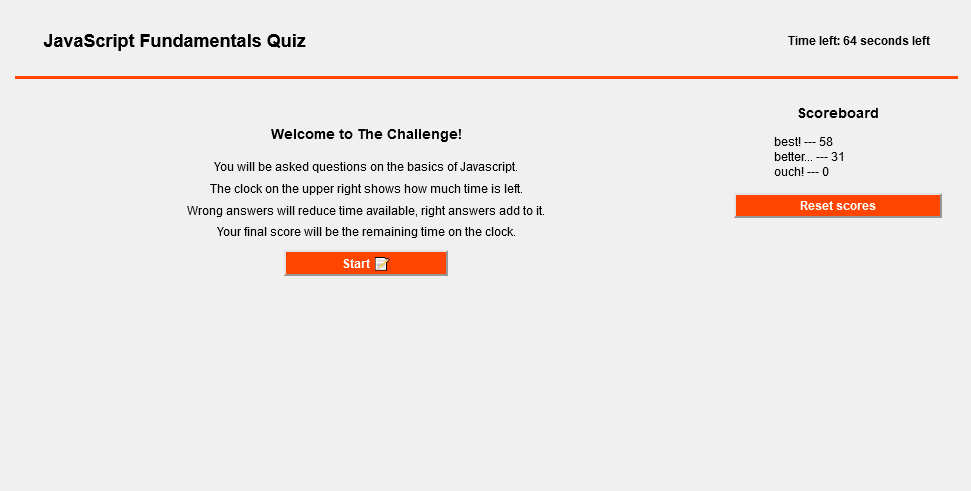

# verbose-telegram
[Link to deployed application.](https://karlnh.github.io/verbose-telegram/)

## Description

A timed quiz testing JavaScript fundamentals featuring a scoreboard of locally-stored scores.

The user is presented with a series of somewhat basic Javascript questions. When a question is answered incorrectly, time is docked from the timer (the amount is logged in the console). When answered correctly, the timer continues as normal, and the next question is presented. When either the last question is completed or the timer reaches 0, the game is over, and the user is presented with their score, and the option to save the score with a name to local storage, which is then retrieved by the scoreboard and displayed.

This project was developed to exercise my understanding of how Javascript can be used to flesh out barebones HTML (and by extension gaining an understanding of how APIs like the DOM can be used).

## Usage

The application is used similarly to other test-taking websites and applications. One clicks start to begin the timer and quiz, and in response to the question clicks on the answer they believe is correct. The test will dock points if the answer is incorrect. At the end, the option to save the final score is displayed. One may enter a name to associate with the score, and this name and score will be saved locally.

## License

This project is licensed under the [GNU General Public License v3](https://www.gnu.org/licenses/gpl-3.0.html).
